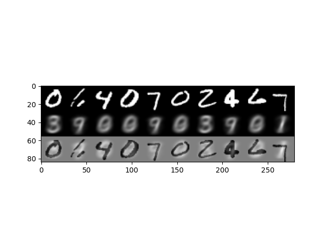
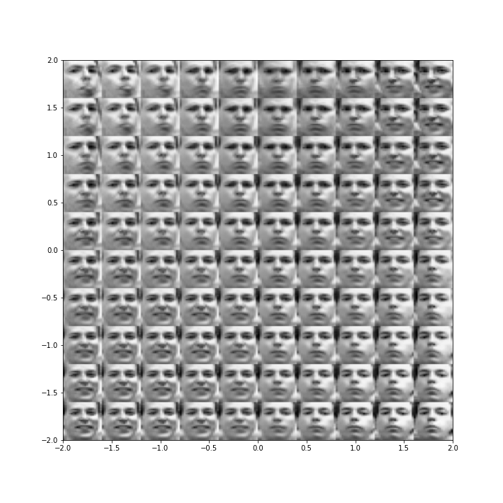

# VAE
This is the simple implementation of variational autoencoder. Check ae.ipynb for the standard autoencoder and vae.ipynb for the variational autoencoder.  The latent code is more densely distributed in variational autoencoder because of the KL divergence with the prior distribution that is normal distribution.   

## Contribution
Simple implementation of variational autoencoder.  The differences with the references are following. 

- I added a sparse binary version of VAE using the straight through gradients. [Reference](https://arxiv.org/abs/1308.3432)

- [Pytorch VAE tutorial](https://github.com/AntixK/PyTorch-VAE/blob/master/models/vanilla_vae.py) I use ipynb and added a plot showing the distribution of the latent codes.  
- [VAE tutorial by Alexander Van de Kleut](https://avandekleut.github.io/vae/) The reference uses the mean square error. I use the binary cross entropy because it is what original reference uses.  

## Reference 
- Kingma, Diederik P., and Max Welling. "Auto-encoding variational bayes." arXiv preprint arXiv:1312.6114 (2013).
-  https://avandekleut.github.io/vae/
- [Pytorch VAE tutorial](https://github.com/AntixK/PyTorch-VAE/blob/master/models/vanilla_vae.py)  
- [Frey face Dataset](https://cs.nyu.edu/~roweis/data.html) 
- [Frey dataset loading](https://github.com/cvybhu/VAE)  code for the frey dataset loader

## Output sample

Latent code distribution of the autoencoder

Sampling of the autoencoder

Latent code distribution of the variational autoencoder

Sampling of the autoencoder

Frey face dataset
